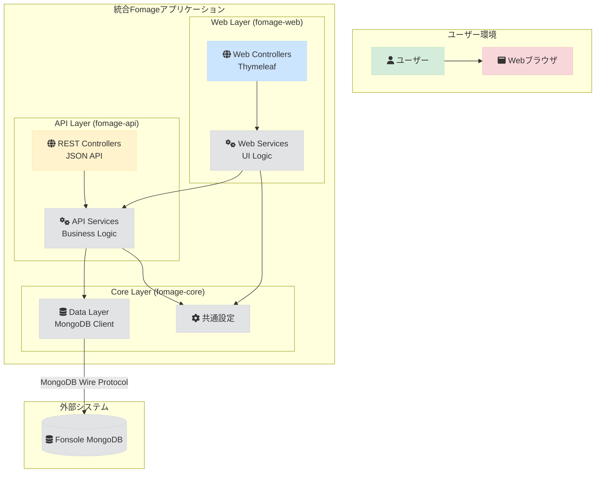

# Fomage システム設計

このドキュメントでは、`fomage`のアーキテクチャ、技術スタック、および主要コンポーネントについて詳述します。

## 1. 概要

`fomage`は、`fonsole`アプリケーションのバックアップデータを管理するためのWebベースツールです。マルチモジュール構成として実装され、一つのSpring Bootアプリケーション内でWeb UIとREST APIを統合しています。

主要な設計原則：
- **マルチモジュール構成**: Web UIとREST APIをモジュールとして分離し、それぞれの責務を明確化
- **単一アプリケーション**: 一つのJVMプロセスで動作し、リソースを効率的に利用
- **安全性**: `fonsole`のデータへのアクセスは、適切な認証・認可を経て行われます

## 2. アーキテクチャ図

`fomage`は統合アーキテクチャとして実装され、一つのSpring Bootアプリケーション内でWeb UIとREST APIが統合されています。



## 3. モジュール構成

### 3.1. fomage-web (Web UI モジュール)

Web UIを提供するモジュールです。Thymeleafテンプレートエンジンを使用してサーバーサイドレンダリングを行います。

#### 3.1.1. Web Layer (Controllers)
- **役割**:
  - HTTPリクエストの受付とレスポンスの生成
  - ThymeleafテンプレートエンジンによるHTMLページの生成
  - セッション管理とユーザー認証
  - fomage-apiモジュールへの直接メソッド呼び出し
- **実装**: Spring MVC Controllers + Thymeleaf

#### 3.1.2. Web Service Layer
- **役割**:
  - fomage-apiモジュールとの直接通信処理
  - UI固有のビジネスロジック
  - データの整形とプレゼンテーション
- **実装**: Spring Service Beans + 直接依存性注入

### 3.2. fomage-api (REST API モジュール)

RESTful APIを提供するモジュールです。データベースアクセスとビジネスロジックを担当します。

#### 3.2.1. REST API Layer (Controllers)
- **役割**:
  - RESTful APIエンドポイントの提供
  - JSON形式でのデータ交換
  - API認証・認可
- **実装**: Spring MVC REST Controllers

#### 3.2.2. API Service Layer (Business Logic)
- **役割**:
  - ビジネスロジックの実装
  - データバリデーション
  - トランザクション管理
- **実装**: Spring Service Beans

### 3.3. fomage-core (共通モジュール)

共通の設定、データアクセス、ユーティリティを提供するモジュールです。

#### 3.3.1. Data Layer (MongoDB Client)
- **役割**:
  - `fonsole`MongoDBとの通信
  - データアクセスロジック
  - クエリの最適化
- **実装**: Spring Data MongoDB

#### 3.3.2. Configuration Layer
- **役割**:
  - 共通設定の管理
  - セキュリティ設定
  - データベース接続設定
- **実装**: Spring Configuration Classes

### 3.4. Fonsole MongoDB

`fonsole`アプリケーションが生成したバックアップデータやプロジェクト情報が格納されているデータベースです。`fomage-core`がこのデータベースを管理対象とします。

- **役割**:
  - `fonsole`の永続データの保管
  - `fomage-core`によるデータ操作の対象

## 4. 技術スタック

`fomage`の開発と運用には、以下の技術が採用されています。

| カテゴリ | 技術 | 目的 |
|---|---|---|
| **アプリケーションフレームワーク** | [Spring Boot](https://spring.io/projects/spring-boot) | Java/KotlinベースのWebアプリケーションフレームワーク。自動設定と組み込みサーバーを提供。 |
| **プログラミング言語** | [Kotlin](https://kotlinlang.org/) | JVM上で動作する静的型付け言語。コードの安全性と表現力を両立。 |
| **Webフレームワーク** | [Spring MVC](https://docs.spring.io/spring-framework/reference/web/webmvc.html) | Spring BootのWeb層。RESTful APIとMVCパターンを実装。 |
| **テンプレートエンジン** | [Thymeleaf](https://www.thymeleaf.org/) | サーバーサイドテンプレートエンジン。HTMLページの動的生成。 |
| **データアクセス** | [Spring Data MongoDB](https://spring.io/projects/spring-data-mongodb) | MongoDBとの統合。リポジトリパターンとクエリDSLを提供。 |
| **ビルドツール** | [Gradle](https://gradle.org/) | ビルド自動化ツール。マルチモジュール構成と依存関係の管理。 |
| **データベース** | [MongoDB](https://www.mongodb.com/) | 管理対象の`fonsole`データベース。ドキュメント指向で柔軟なデータ構造に対応。 |
| **セキュリティ** | [Spring Security](https://spring.io/projects/spring-security) | 認証・認可フレームワーク。セキュリティ機能を提供。 |
| **インフラ** | [Docker](https://www.docker.com/) | コンテナ化技術。開発環境と本番環境の一貫性を保証。 |
| | [Kubernetes](https://kubernetes.io/) | コンテナオーケストレーション。デプロイ、スケーリング、管理を自動化。 |

## 5. データフロー

ユーザーがデータを閲覧する際の典型的なデータフローは以下の通りです。

1. **ユーザー操作**: ユーザーがブラウザでデータ一覧ページにアクセスします。
2. **Web UI リクエスト**: ブラウザがfomageアプリケーションにHTTPリクエストを送信します。
3. **Web Controller処理**: Spring MVC Controllerがリクエストを受け、Web Serviceを呼び出します。
4. **内部通信**: Web Serviceがfomage-apiモジュールのServiceを直接呼び出します。
5. **API Service処理**: API Serviceでビジネスロジックを実行し、Repositoryを通じてデータアクセスを行います。
6. **データ取得**: Spring Data MongoDBが`fonsole`のMongoDBにクエリを発行し、データを取得します。
7. **データ返却**: API ServiceがデータをWeb Serviceに返却します。
8. **Web UI レスポンス**: Web UIがThymeleafテンプレートを使用してHTMLレスポンスを生成します。
9. **画面表示**: ブラウザがHTMLレスポンスを受信し、画面に表示します。

## 6. モジュール間通信

### 6.1. fomage-web → fomage-api 通信

- **通信方式**: 直接メソッド呼び出し（依存性注入）
- **データ形式**: Kotlinオブジェクト
- **認証**: Spring Securityによる内部認証
- **実装**: Spring DIコンテナによる依存性注入

### 6.2. 設定管理

- **接続情報**: 共通設定ファイル（`application.yml`）や環境変数で管理
- **モジュール設定**: 各モジュール固有の設定は環境変数で設定可能
- **セキュリティ**: 統合されたセキュリティ設定で管理

## 7. Fonsoleとの連携

`fomage-core`と`fonsole`は、MongoDBデータベースを介して連携します。

- **接続情報**: `fomage-core`はSpring Bootの設定ファイル（`application.yml`）や環境変数を通じて`fonsole`のMongoDB接続情報（URI, データベース名など）を取得します。
- **スキーマ管理**: `fomage-core`は`fonsole`のデータスキーマを動的に解釈し、適切なAPIレスポンスを生成します。Spring Data MongoDBの柔軟なマッピング機能を活用します。
- **安全性**: `fomage-core`から`fonsole`データベースへのアクセスは、Spring Securityによる認証・認可と、MongoDBの権限設定により制御されます。

## 8. プロジェクト構造

```
fomage/
├── build.gradle                    # ルートプロジェクトのビルド設定
├── settings.gradle                 # マルチモジュール設定
├── fomage-web/                     # Web UI モジュール
│   ├── build.gradle               # Web UI モジュールのビルド設定
│   └── src/
│       ├── main/
│       │   ├── kotlin/net/kigawa/fomage/web/
│       │   │   ├── controller/                # Web Layer
│       │   │   │   ├── DataController.kt     # データ表示用Controller
│       │   │   │   └── AdminController.kt    # 管理機能用Controller
│       │   │   ├── service/                   # Web Service Layer
│       │   │   │   ├── ApiClientService.kt   # 内部API通信サービス
│       │   │   │   └── DataPresentationService.kt # データ整形サービス
│       │   │   └── model/                     # UI用データモデル
│       │   │       └── DataViewModel.kt      # 表示用データモデル
│       │   └── resources/
│       │       ├── templates/                 # Thymeleafテンプレート
│       │       │   ├── data/
│       │       │   │   ├── list.html         # データ一覧ページ
│       │       │   │   └── detail.html       # データ詳細ページ
│       │       │   └── admin/
│       │       │       └── dashboard.html    # 管理ダッシュボード
│       │       ├── static/                    # 静的リソース
│       │       │   ├── css/
│       │       │   ├── js/
│       │       │   └── images/
│       │       └── application-web.yml       # Web UI設定
│       └── test/                              # テストコード
│           └── kotlin/net/kigawa/fomage/web/
│               ├── controller/
│               └── service/
├── fomage-api/                     # REST API モジュール
│   ├── build.gradle              # API モジュールのビルド設定
│   └── src/
│       ├── main/
│       │   ├── kotlin/net/kigawa/fomage/api/
│       │   │   ├── controller/                # REST API Layer
│       │   │   │   ├── DataApiController.kt   # データAPI用Controller
│       │   │   │   └── AdminApiController.kt  # 管理API用Controller
│       │   │   ├── service/                   # API Service Layer
│       │   │   │   ├── DataService.kt         # データ操作サービス
│       │   │   │   └── SchemaService.kt       # スキーマ管理サービス
│       │   │   └── model/                     # API用データモデル
│       │   │       └── FonsoleData.kt         # fonsoleデータのモデル
│       │   └── resources/
│       │       └── application-api.yml        # API設定
│       └── test/                               # テストコード
│           └── kotlin/net/kigawa/fomage/api/
│               ├── controller/
│               └── service/
├── fomage-core/                    # 共通モジュール
│   ├── build.gradle              # 共通モジュールのビルド設定
│   └── src/
│       ├── main/
│       │   ├── kotlin/net/kigawa/fomage/core/
│       │   │   ├── config/                    # 共通設定クラス
│       │   │   │   ├── MongoConfig.kt         # MongoDB設定
│       │   │   │   ├── SecurityConfig.kt      # セキュリティ設定
│       │   │   │   └── WebClientConfig.kt     # WebClient設定
│       │   │   ├── repository/                # Data Layer
│       │   │   │   └── FonsoleRepository.kt   # MongoDBアクセス用Repository
│       │   │   ├── model/                     # 共通データモデル
│       │   │   └── util/                      # 共通ユーティリティ
│       │   └── resources/
│       │       └── application.yml            # 共通設定
│       └── test/
│           └── kotlin/net/kigawa/fomage/core/
│               ├── config/
│               ├── repository/
│               └── util/
└── src/                            # メインアプリケーション
    ├── main/
    │   ├── kotlin/net/kigawa/fomage/
    │   │   └── FomageApplication.kt           # メインアプリケーションクラス
    │   └── resources/
    │       └── application.yml                # メイン設定
    └── test/
        └── kotlin/net/kigawa/fomage/
```

## 9. 統合アーキテクチャの実装

### 9.1. メインアプリケーションクラス

```kotlin
@SpringBootApplication
@ComponentScan(basePackages = [
    "net.kigawa.fomage",
    "net.kigawa.fomage.web",
    "net.kigawa.fomage.api",
    "net.kigawa.fomage.core"
])
class FomageApplication

fun main(args: Array<String>) {
    runApplication<FomageApplication>(*args)
}
```

### 9.2. モジュール間通信の実装

```kotlin
// fomage-web の WebService
@Service
class ApiClientService(
    private val dataService: DataService  // 直接注入
) {
    fun getData(): Mono<Data> {
        return Mono.fromCallable { dataService.getData() }
    }
}
```

### 9.3. 設定の統合

```yaml
# application.yml
spring:
  application:
    name: fomage
  
  # MongoDB設定（共通）
  data:
    mongodb:
      uri: ${FONSOLE_MONGODB_URI:mongodb://localhost:27017/fonsole}
      database: ${FONSOLE_DATABASE:fonsole}

# Web UI設定
fomage:
  web:
    context-path: /
    port: 8080

# API設定
fomage:
  api:
    context-path: /api
    port: 8080  # 同じポートで動作

# セキュリティ設定
fomage:
  security:
    enabled: true
    api-key: ${FOMAGE_API_KEY:default-key}
```

### 9.4. ルーティング設定

```kotlin
@Configuration
class RoutingConfig {
    
    @Bean
    fun webRouter(): RouterFunction<ServerResponse> {
        return RouterFunctions
            .route()
            .path("/api") { apiRoutes() }
            .path("/") { webRoutes() }
            .build()
    }
    
    private fun apiRoutes(): RouterFunction<ServerResponse> {
        return RouterFunctions
            .route()
            .GET("/data", DataApiController::getData)
            .GET("/admin", AdminApiController::getAdminData)
            .build()
    }
    
    private fun webRoutes(): RouterFunction<ServerResponse> {
        return RouterFunctions
            .route()
            .GET("/data", DataController::showDataList)
            .GET("/admin", AdminController::showAdminDashboard)
            .build()
    }
}
```

### 9.5. ビルド設定

```gradle
// settings.gradle
rootProject.name = 'fomage'
include 'fomage-web'
include 'fomage-api'
include 'fomage-core'

// build.gradle (ルート)
plugins {
    id 'org.springframework.boot' version '3.2.0'
    id 'io.spring.dependency-management' version '1.1.4'
    id 'org.jetbrains.kotlin.jvm' version '1.9.20'
    id 'org.jetbrains.kotlin.plugin.spring' version '1.9.20'
}

allprojects {
    group = 'net.kigawa.fomage'
    version = '1.0.0'
    
    repositories {
        mavenCentral()
    }
}

subprojects {
    apply plugin: 'kotlin'
    apply plugin: 'kotlin-spring'
    
    dependencies {
        implementation 'org.springframework.boot:spring-boot-starter'
        implementation 'org.jetbrains.kotlin:kotlin-reflect'
        testImplementation 'org.springframework.boot:spring-boot-starter-test'
    }
}
```

## 10. 統合アーキテクチャのメリット

1. **単一アプリケーション**: 一つのJVMプロセスで動作
2. **共有リソース**: メモリ、コネクションプール、設定の共有
3. **簡素化されたデプロイ**: 一つのアーティファクトでデプロイ
4. **内部通信の最適化**: HTTP通信ではなく、直接メソッド呼び出し
5. **設定管理の統一**: 一つの設定ファイルで管理
6. **モジュールの分離**: 保守性と開発効率を維持しながら、単一アプリケーションの利点を享受

統合アーキテクチャにより、モジュールの分離による保守性と開発効率を保ちながら、単一アプリケーションの利点を享受できます。各モジュールは独立して開発・テストが可能で、必要に応じて将来的に再分離することも容易です。

---