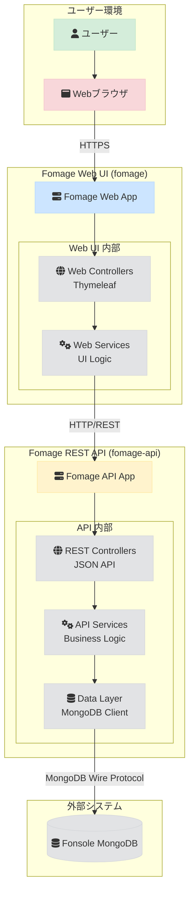

# Fomage システム設計

このドキュメントでは、`fomage`のアーキテクチャ、技術スタック、および主要コンポーネントについて詳述します。

## 1. 概要

`fomage`は、`fonsole`アプリケーションのバックアップデータを管理するためのWebベースツールです。マルチモジュール構成として実装され、Web UI（`fomage`）とREST API（`fomage-api`）に分離されています。

主要な設計原則：
- **マルチモジュール構成**: Web UIとREST APIを分離し、それぞれの責務を明確化
- **マイクロサービス志向**: APIとUIの独立した開発・デプロイが可能
- **安全性**: `fonsole`のデータへのアクセスは、適切な認証・認可を経て行われます

## 2. アーキテクチャ図

`fomage`はマルチモジュール構成として実装され、Web UIとREST APIが分離されています。



## 3. モジュール構成

### 3.1. fomage (Web UI モジュール)

Web UIを提供するSpring Bootアプリケーションです。Thymeleafテンプレートエンジンを使用してサーバーサイドレンダリングを行います。

#### 3.1.1. Web Layer (Controllers)
- **役割**:
  - HTTPリクエストの受付とレスポンスの生成
  - ThymeleafテンプレートエンジンによるHTMLページの生成
  - セッション管理とユーザー認証
  - fomage-apiへのREST API呼び出し
- **実装**: Spring MVC Controllers + Thymeleaf

#### 3.1.2. Web Service Layer
- **役割**:
  - fomage-apiとの通信処理
  - UI固有のビジネスロジック
  - データの整形とプレゼンテーション
- **実装**: Spring Service Beans + RestTemplate/WebClient

### 3.2. fomage-api (REST API モジュール)

RESTful APIを提供するSpring Bootアプリケーションです。データベースアクセスとビジネスロジックを担当します。

#### 3.2.1. REST API Layer (Controllers)
- **役割**:
  - RESTful APIエンドポイントの提供
  - JSON形式でのデータ交換
  - API認証・認可
- **実装**: Spring MVC REST Controllers

#### 3.2.2. API Service Layer (Business Logic)
- **役割**:
  - ビジネスロジックの実装
  - データバリデーション
  - トランザクション管理
- **実装**: Spring Service Beans

#### 3.2.3. Data Layer (MongoDB Client)
- **役割**:
  - `fonsole`MongoDBとの通信
  - データアクセスロジック
  - クエリの最適化
- **実装**: Spring Data MongoDB

### 3.3. Fonsole MongoDB

`fonsole`アプリケーションが生成したバックアップデータやプロジェクト情報が格納されているデータベースです。`fomage-api`がこのデータベースを管理対象とします。

- **役割**:
  - `fonsole`の永続データの保管
  - `fomage-api`によるデータ操作の対象

## 4. 技術スタック

`fomage`の開発と運用には、以下の技術が採用されています。

| カテゴリ | 技術 | 目的 |
|---|---|---|
| **アプリケーションフレームワーク** | [Spring Boot](https://spring.io/projects/spring-boot) | Java/KotlinベースのWebアプリケーションフレームワーク。自動設定と組み込みサーバーを提供。 |
| **プログラミング言語** | [Kotlin](https://kotlinlang.org/) | JVM上で動作する静的型付け言語。コードの安全性と表現力を両立。 |
| **Webフレームワーク** | [Spring MVC](https://docs.spring.io/spring-framework/reference/web/webmvc.html) | Spring BootのWeb層。RESTful APIとMVCパターンを実装。 |
| **テンプレートエンジン** | [Thymeleaf](https://www.thymeleaf.org/) | サーバーサイドテンプレートエンジン。HTMLページの動的生成。 |
| **HTTP クライアント** | [WebClient](https://docs.spring.io/spring-framework/reference/web/webflux-webclient.html) | 非同期HTTPクライアント。fomage-apiとの通信に使用。 |
| **データアクセス** | [Spring Data MongoDB](https://spring.io/projects/spring-data-mongodb) | MongoDBとの統合。リポジトリパターンとクエリDSLを提供。 |
| **ビルドツール** | [Gradle](https://gradle.org/) | ビルド自動化ツール。マルチモジュール構成と依存関係の管理。 |
| **データベース** | [MongoDB](https://www.mongodb.com/) | 管理対象の`fonsole`データベース。ドキュメント指向で柔軟なデータ構造に対応。 |
| **セキュリティ** | [Spring Security](https://spring.io/projects/spring-security) | 認証・認可フレームワーク。セキュリティ機能を提供。 |
| **インフラ** | [Docker](https://www.docker.com/) | コンテナ化技術。開発環境と本番環境の一貫性を保証。 |
| | [Kubernetes](https://kubernetes.io/) | コンテナオーケストレーション。デプロイ、スケーリング、管理を自動化。 |

## 5. データフロー

ユーザーがデータを閲覧する際の典型的なデータフローは以下の通りです。

1. **ユーザー操作**: ユーザーがブラウザでデータ一覧ページにアクセスします。
2. **Web UI リクエスト**: ブラウザがfomage Web UIにHTTPリクエストを送信します。
3. **Web Controller処理**: Spring MVC Controllerがリクエストを受け、Web Serviceを呼び出します。
4. **API呼び出し**: Web Serviceがfomage-apiにREST APIリクエストを送信します。
5. **API Controller処理**: fomage-apiのREST Controllerがリクエストを受け、API Serviceを呼び出します。
6. **API Service処理**: API Serviceでビジネスロジックを実行し、Repositoryを通じてデータアクセスを行います。
7. **データ取得**: Spring Data MongoDBが`fonsole`のMongoDBにクエリを発行し、データを取得します。
8. **API レスポンス**: fomage-apiがJSONレスポンスを返します。
9. **Web UI レスポンス**: Web UIがThymeleafテンプレートを使用してHTMLレスポンスを生成します。
10. **画面表示**: ブラウザがHTMLレスポンスを受信し、画面に表示します。

## 6. モジュール間通信

### 6.1. fomage → fomage-api 通信

- **通信方式**: HTTP/REST API
- **データ形式**: JSON
- **認証**: API Key または JWT Token
- **実装**: Spring WebClient を使用した非同期HTTP通信

### 6.2. 設定管理

- **接続情報**: 各モジュールの設定ファイル（`application.yml`）や環境変数で管理
- **API エンドポイント**: fomage-apiのURLは環境変数で設定可能
- **セキュリティ**: モジュール間通信の認証情報も環境変数で管理

## 7. Fonsoleとの連携

`fomage-api`と`fonsole`は、MongoDBデータベースを介して連携します。

- **接続情報**: `fomage-api`はSpring Bootの設定ファイル（`application.yml`）や環境変数を通じて`fonsole`のMongoDB接続情報（URI, データベース名など）を取得します。
- **スキーマ管理**: `fomage-api`は`fonsole`のデータスキーマを動的に解釈し、適切なAPIレスポンスを生成します。Spring Data MongoDBの柔軟なマッピング機能を活用します。
- **安全性**: `fomage-api`から`fonsole`データベースへのアクセスは、Spring Securityによる認証・認可と、MongoDBの権限設定により制御されます。

## 8. プロジェクト構造

```
fomage/
├── build.gradle                    # ルートプロジェクトのビルド設定
├── settings.gradle                 # マルチモジュール設定
├── fomage/                         # Web UI モジュール
│   ├── build.gradle               # Web UI モジュールのビルド設定
│   └── src/
│       ├── main/
│       │   ├── kotlin/net/kigawa/fomage/
│       │   │   ├── FomageWebApplication.kt    # Web UI メインクラス
│       │   │   ├── controller/                # Web Layer
│       │   │   │   ├── DataController.kt     # データ表示用Controller
│       │   │   │   └── AdminController.kt    # 管理機能用Controller
│       │   │   ├── service/                   # Web Service Layer
│       │   │   │   ├── ApiClientService.kt   # fomage-api通信サービス
│       │   │   │   └── DataPresentationService.kt # データ整形サービス
│       │   │   ├── model/                     # UI用データモデル
│       │   │   │   └── DataViewModel.kt      # 表示用データモデル
│       │   │   └── config/                    # 設定クラス
│       │   │       ├── WebClientConfig.kt    # WebClient設定
│       │   │       └── SecurityConfig.kt     # セキュリティ設定
│       │   └── resources/
│       │       ├── templates/                 # Thymeleafテンプレート
│       │       │   ├── data/
│       │       │   │   ├── list.html         # データ一覧ページ
│       │       │   │   └── detail.html       # データ詳細ページ
│       │       │   └── admin/
│       │       │       └── dashboard.html    # 管理ダッシュボード
│       │       ├── static/                    # 静的リソース
│       │       │   ├── css/
│       │       │   ├── js/
│       │       │   └── images/
│       │       └── application.yml           # Web UI設定
│       └── test/                              # テストコード
│           └── kotlin/net/kigawa/fomage/
│               ├── controller/
│               └── service/
└── fomage-api/                    # REST API モジュール
    ├── build.gradle              # API モジュールのビルド設定
    └── src/
        ├── main/
        │   ├── kotlin/net/kigawa/fomage/api/
        │   │   ├── FomageApiApplication.kt    # API メインクラス
        │   │   ├── controller/                # REST API Layer
        │   │   │   ├── DataApiController.kt   # データAPI用Controller
        │   │   │   └── AdminApiController.kt  # 管理API用Controller
        │   │   ├── service/                   # API Service Layer
        │   │   │   ├── DataService.kt         # データ操作サービス
        │   │   │   └── SchemaService.kt       # スキーマ管理サービス
        │   │   ├── repository/                # Data Layer
        │   │   │   └── FonsoleRepository.kt   # MongoDBアクセス用Repository
        │   │   ├── model/                     # API用データモデル
        │   │   │   └── FonsoleData.kt         # fonsoleデータのモデル
        │   │   └── config/                    # 設定クラス
        │   │       ├── MongoConfig.kt         # MongoDB設定
        │   │       └── SecurityConfig.kt      # セキュリティ設定
        │   └── resources/
        │       └── application.yml            # API設定
        └── test/                               # テストコード
            └── kotlin/net/kigawa/fomage/api/
                ├── controller/
                ├── service/
                └── repository/
```

---